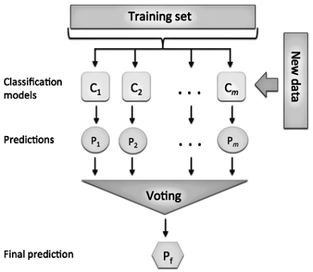
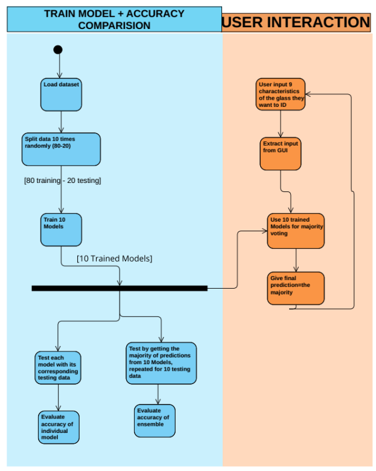
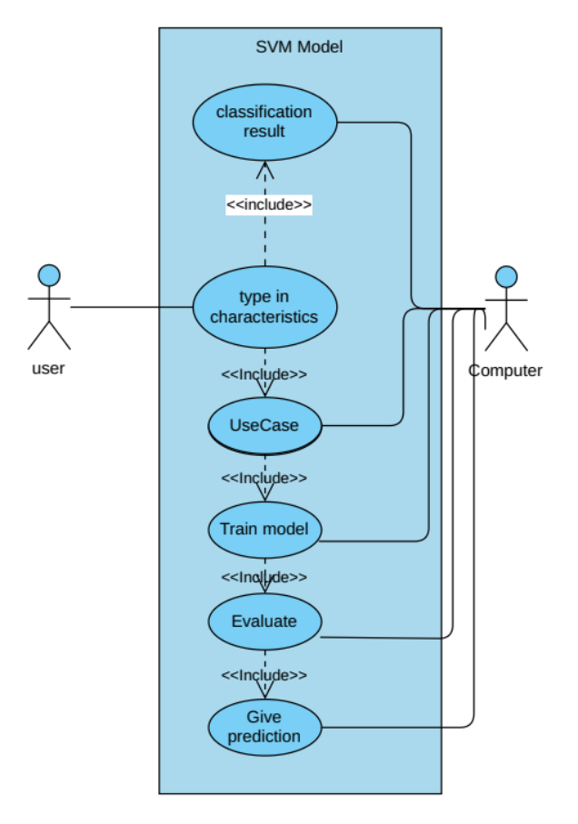
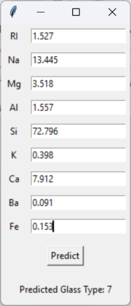

# Glass Classification with SVM + Majority Voting

Classify glass types from chemical composition using a Support Vector Machine (SVM) baseline and a simple **majority-vote ensemble**. A minimal **Tkinter GUI** is included for manual input and quick predictions.

---

## Table of Contents
- [Overview](#overview)
- [Dataset](#dataset)
- [Method](#method)
- [Results](#results)
- [UML](#uml)
- [GUI](#gui)
- [Getting Started](#getting-started)
- [Project Notes](#project-notes)
- [References](#references)
- [License](#license)

---

## Overview
- **Goal:** Predict glass type from 9 chemical features (RI, Na, Mg, Al, Si, K, Ca, Ba, Fe).
- **Baseline:** `sklearn.svm.SVC` (RBF kernel).
- **Ensemble:** Train 10 SVMs on different stratified splits → final label by **majority vote**.
- **Why it works:** Individual SVMs score ~60–74% on test splits; ensembling stabilizes decisions and boosts final accuracy.

---

## Dataset
- **Source:** UCI Glass Identification Dataset  
- **Samples:** 214  
- **Features:** RI, Na, Mg, Al, Si, K, Ca, Ba, Fe  
- **Classes:** 1, 2, 3, 5, 6, 7  
- **Preprocessing:** `StandardScaler`; stratified 80/20 train–test splits for each model.

---

## Method
**SVM (sklearn.svm.SVC)**
- Kernel: `rbf`
- Tuned by trial runs:
  - `C = 100`
  - `gamma = 0.1`

**Majority Voting**
- Train **10** SVMs with different stratified splits (80/20).
- For each test batch (and GUI input), get 10 predictions → take the most frequent label.

  

---

## Results
**Before majority vote (per-model accuracies):** 60.47% – 74.42%

**After majority vote (overall):**
- **Accuracy:** 95.35%  
- **Precision:** 96%  
- **Recall:** 95%  
- **F1-Score:** 95%

Per-class summary (from classification report):

| Class | Precision | Recall | F1-Score | Support |
|------:|:---------:|:------:|:--------:|-------:|
| 1     | 0.92 | 0.96 | 0.94 | 140 |
| 2     | 0.98 | 0.91 | 0.94 | 150 |
| 3     | 0.86 | 1.00 | 0.92 | 30  |
| 5     | 1.00 | 1.00 | 1.00 | 30  |
| 6     | 1.00 | 1.00 | 1.00 | 20  |
| 7     | 1.00 | 1.00 | 1.00 | 60  |

---

## UML
**Activity Diagram**

**Use Case Diagram**

---

## GUI
A tiny **Tkinter** app lets you type the 9 features and shows the predicted class (and, optionally, per-model votes).

---

